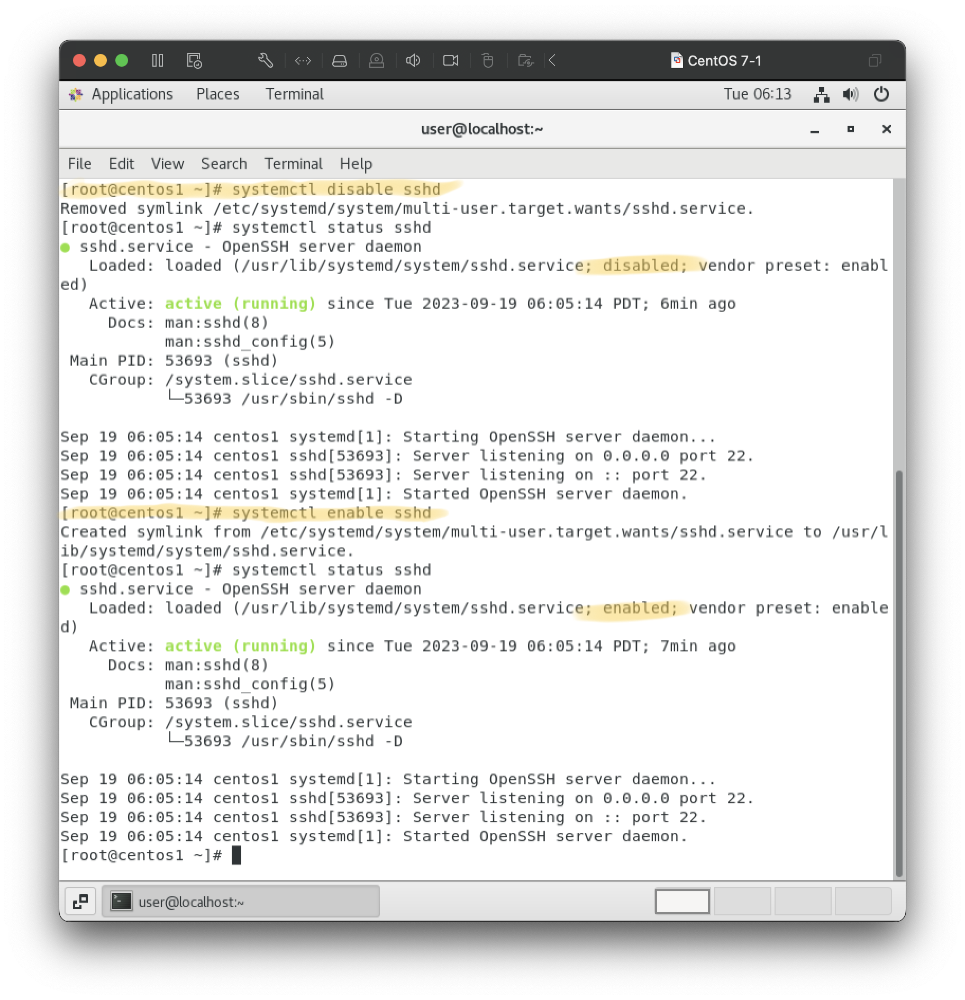

# 20230912

## setup
1. install vmware/virtualbox
2. install at least 2 vm

## 修改主機名稱  
```
root@machine ~ $ hostnamectl set-hostname (hostname) 
root@machine ~ $ bash //重新執行 
```


## 查看ssh server套件安裝
```
rpm -qa | grep ssh
```
q: query / a: all  
grep: 來自於正規表示法的 g/RE/p，其意義是代表以正規表示法全域搜尋並列印出來（globally search for RE and print it）。

openssh-server: ssh server

## 套件安裝、移除
以openssh-server為例：
1. 移除: `rpm -e openssh-server `  
    e: erase

2. 安裝: `yum install openssh-server`


## Systemctl
### `systemctl (action) (servername)`
1. actions: start啟動 / stop關閉 / restart重啟 / reload重載 / status狀態
2. servername: sshd / httpd / vsftpd  
d: daemon (server in linux)  
3. example:  
    #### 啟動 ssh server
    ```
    systemctl start sshd
    systemctl status sshd
    ``` 
    
    #### 關閉 ssh server
    ```
    systemctl stop sshd
    systemctl status sshd
    ```
    

## systemctl status
1. Loaded:   
enabled: 虛擬機開機伺服器會自動啟動 / disabled: 伺服器需手動啟動  
2. Active 啟動狀態: active(running) / inactive(dead)
3. Main PID: process ID

### 修改 loaded
```
systemctl enable/disable (servername)
```


## 圖形化介面設定IP位置
1. power > wired connected > wierd settings > setting


2. 設定iP位置  
details > ipv4 > manual > addresses > apply


3. <b>重啟才會生效</b>  
turn off, then turn on again


4. 讓虛擬機通上internet

設定DNS讓虛擬機可辨別網址，<b>on/off重啟生效</b>


5. 虛擬機互ping


## 編輯 /etc/hosts（ip和domian name對照檔）
1. 圖形化介面：`gedit /etc/hosts`  
terminal: `vim /etc/hosts`


vim 儲存： esc > :wq(儲存並退出)  
2. 虛擬機使用名稱互ping

使用名稱或完整domian name皆可


## vm1連上vm2
 1. `ssh (account)@(vm)`  
example: `ssh root@centos2`
