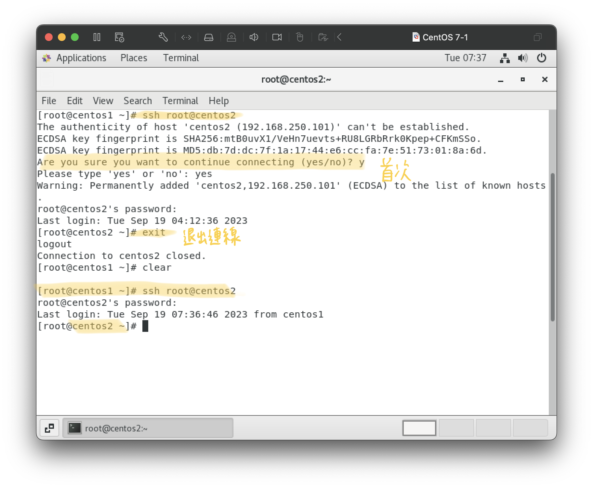
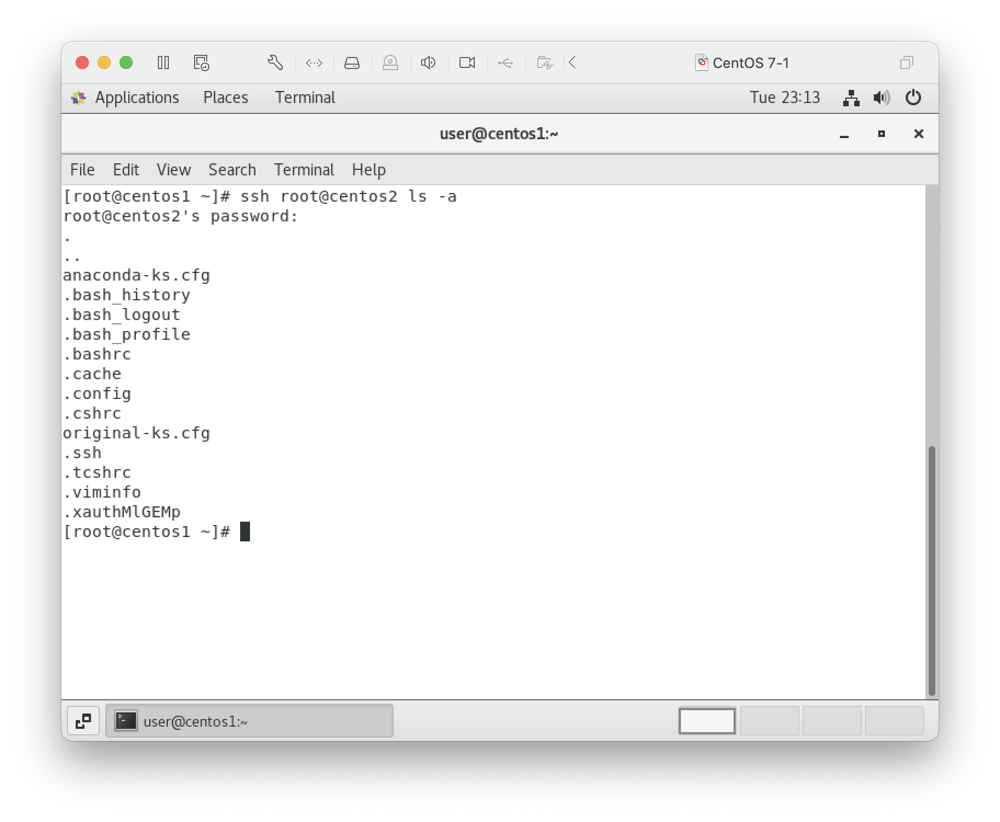

# 20230919
## 伺服器無法連線除錯

1. [查看伺服器狀態](../20230912/20230912.md)
    ```
    systemctl status sshd
    ``` 
     
    Debug: `systemctl start sshd` 啟動伺服器  

2. 確認埠號
    ```
    netstat -tunlp | grep ssh
    ```
    預設：網頁伺服器(:80) / sshd(:22)
    
    -t: tcp  
    -u: udp  
    -n: 不解析  
    -l: listen  
    -p: process ip

3. 檢查selinux 
    ```
    getenforce
    ```  
    
    應設disabled  
    ```
    gedit /etc/selinux/config
    ```
    - SELINUX=disabled  
    - reboot after finish setting

    
    

4. 檢查防火牆
    ```
    systemctl status firewalld.service
    ```
    
    修改防火牆狀態：
    ```
    systemctl enable/disable firewalld.service
    reboot
    ```
5. `reboot`

## HW1: 裝置連線
-  win to linux: putty+winSCP
-  mac t0 linux: terminal+FTPRush
    ```
    ssh root@centos1
    ```
    
    未設定/etc/hosts 連線失敗
    ```
    nano /etc/hosts
    ```
    
    使用FTPRush進行檔案傳輸  
    protorcal:FSTP  
    host: 192.168.xxx.xxx (vm: ~$ ifconfig 查看)  
    username/password  
    port: 22 (default)
    
-  [linux to linux](../20230912/20230912.md)   
    1. terminal setup ip: `gedit /etc/hosts`  
    2. connect: `ssh root@machine2` 
         
        若伺服端口非22埠 `ssh root@machine2 -p (port)` 
    3. 遠端執行指令: `ssh root@machine2 command`
        
    
## HW2: 無密碼登入
1. 產生公鑰私鑰 
    ```
    ssh-keygen
    ```
      
    id_rsa 私鑰  id_rsa.pub 公鑰
2. 將公鑰丟給第二台虛擬機 
    ```
    ssh-copy-id root@machine2
    ```
    

## HW3: machine2 to machine1 無密碼登入 


## HW4: 雙向傳輸
- 機器之間檔案拷貝
    ```
    scp (source) (destination)
    ```
    ex: `scp /etc/hosts root@centos2:etc/aaa`  
    

## command: tree 樹狀結構
1. 新資料夾: `mkdir testdir` 
2. 產生新檔案名為a~z: `touch {a..z}`  

3. 安裝tree: `yum install tree` 
4. 樹狀顯示: `tree /dir`   


## scp dir/ 檔案夾傳輸
```
scp -r (source/) (destination)
```
- -r: 遞迴 recursive  
- ex: `scp -r testdir/ root@centos2:/temp`


## HW5: 改變伺服器埠號
1. `cd /etc/ssh`  
    ssh_config使用者端配置 sshd_config伺服器端配置
    
2. 修改`vim sshd_config`   
    default:
    
    replace:
    
3. 重啟 `systemctl restart sshd`
4. 查看 `systemctl status sshd`
    

# 課本

## 查詢已安裝rpm套件  
```
rpm -qa | grep (keyword)
rpm -qi (...) 
rpm -ql (...)
rpm -qf (...)
```
-q: query  
grep: 過濾  
-a: all  
-i: information