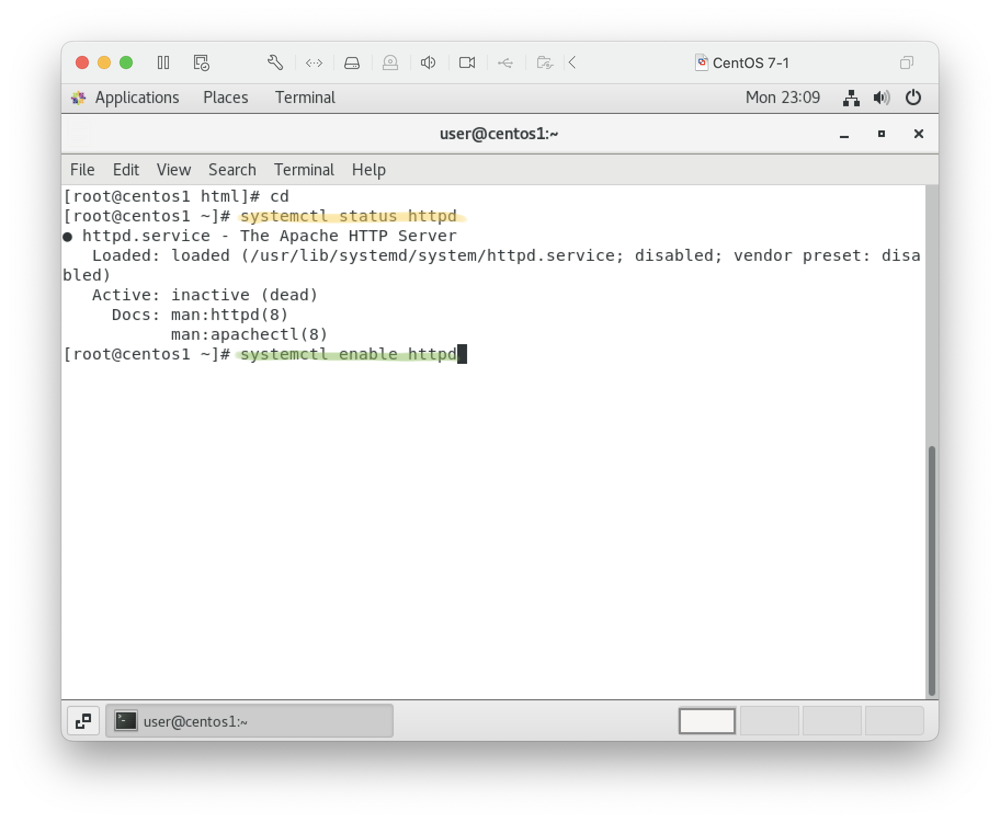
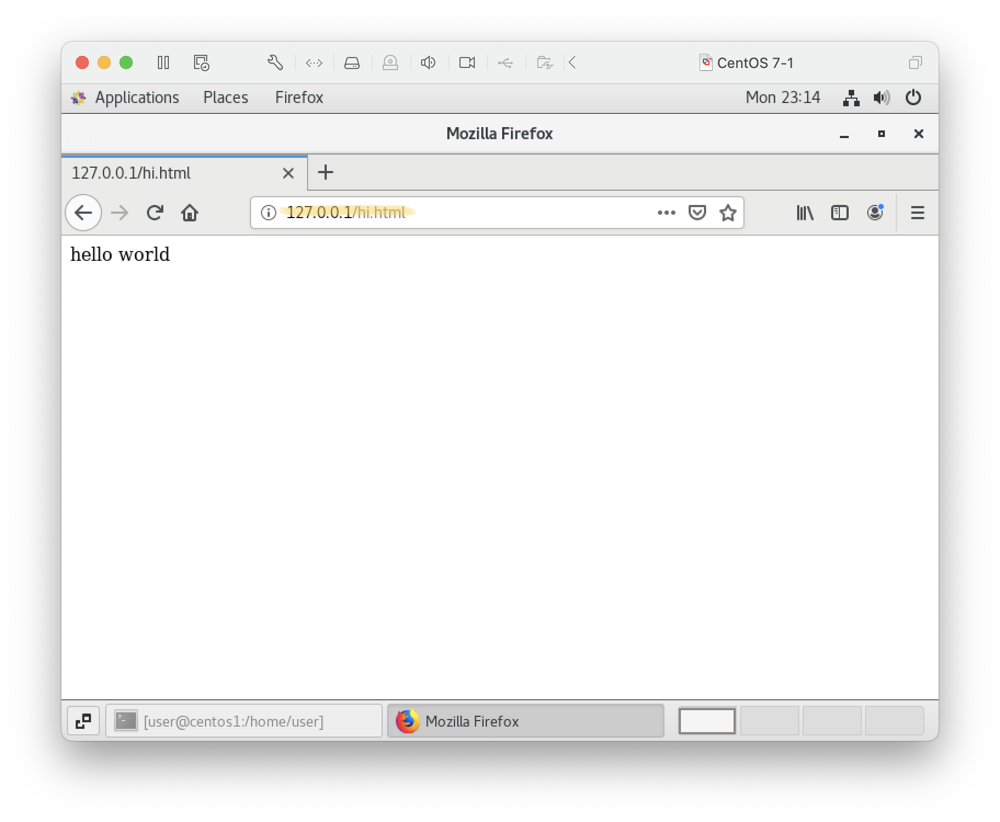
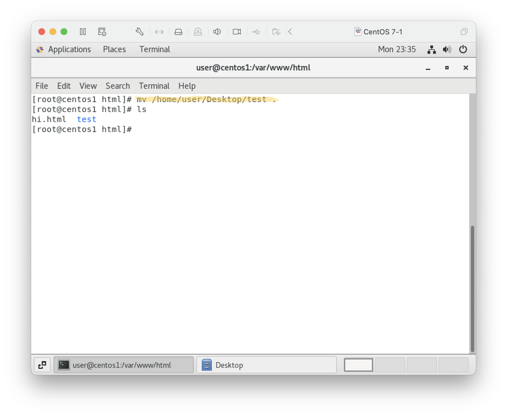
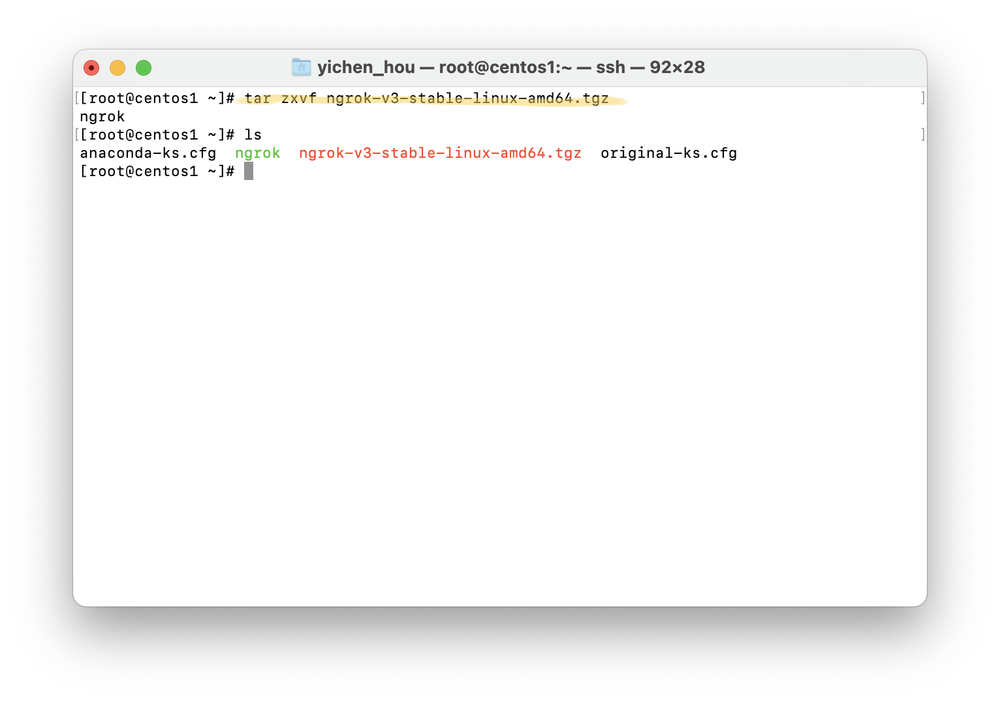
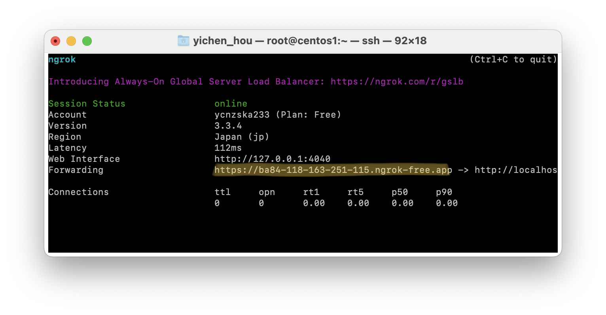

# 20230926

# httpd

1. 查詢套件
    ```
    rpm -qa | grep httpd
    ```
2. 安裝套件
    ```
    yum insatll httpd -y
    ```
    
    ```
    # 強制終止占用行程
    kill -9 (...)
    ```
    centos7 httpd defalt dir: /var/www/html
3. 伺服器狀態
    ```
    systemctl status httpd
    ```
    
    ```
    systemctl enable httpd
    reboot
    ```
    
    ```
    netstat -tunlp | grep httpd
    ```
    
4. 編輯網頁
    ```
    cd /var/www/html
    echo  "hello world" > hi.html
    ```
    

5. 執行 127.0.0.1/hi.html
    

## 編輯網頁
1. 編輯 html 網頁
    
2. 將檔案傳至虛擬機
    
    
3. 搬移資料夾
    ```
    mv (file) .
    ```
    
4. 127.0.0.1/test/test.html
    

## 建立通道連結外網 ngrok
1. Login https://ngrok.com
    
2. Copy link: download for linux 
    ```
    wget https://bin.equinox.io/c/bNyj1mQVY4c/ngrok-v3-stable-linux-amd64.tgz
    ```
    
3. 解壓縮
    ```
    tar zxvf ngrok-v3-stable-linux-amd64.tgz
    ```
    
4. Connect your account 
    - https://dashboard.ngrok.com/get-started/your-authtoken
    - use command line to set up
    
    note: commandline ngrok vs ./ngrok  
    ngrok 目錄位置 in $path: ngrok, not in $path: ./ngrok
5. Fire it uo
    ```
    ngrok http 80
    ```
    
6. Use forwarding url to connect website
    