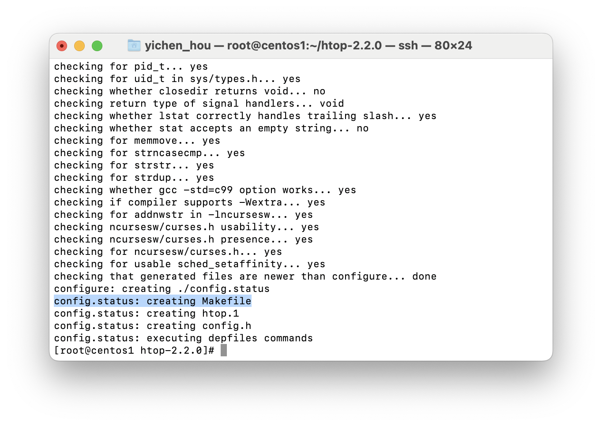

### 20230926
# CH 10

https://www.cnblogs.com/yaoyaojcy/p/17139639.html

## 在linux編譯原始碼：htop
1. [source](https://src.fedoraproject.org/lookaside/extras/htop/htop-2.2.0.tar.gz/sha512/ec1335bf0e3e0387e5e50acbc508d0effad19c4bc1ac312419dc97b82901f4819600d6f87a91668f39d429536d17304d4b14634426a06bec2ecd09df24adc62e/)
2. 
    ```
    wget (file)
    ```
    
3. 
    ```
    tar zxvf htop-2.2.0.tar.gz
    ```
4. `./configure`：確認library是否足夠
    - Error:  
        configure: error: You may want to use --disable-unicode or install libncursesw.
        
        ```
        yum install -y ncurses-devel
        ```
        
5. 產生 makefile
    
6. `make install` ：將程式碼放至對應位置
    
7. `htop`：執行
    