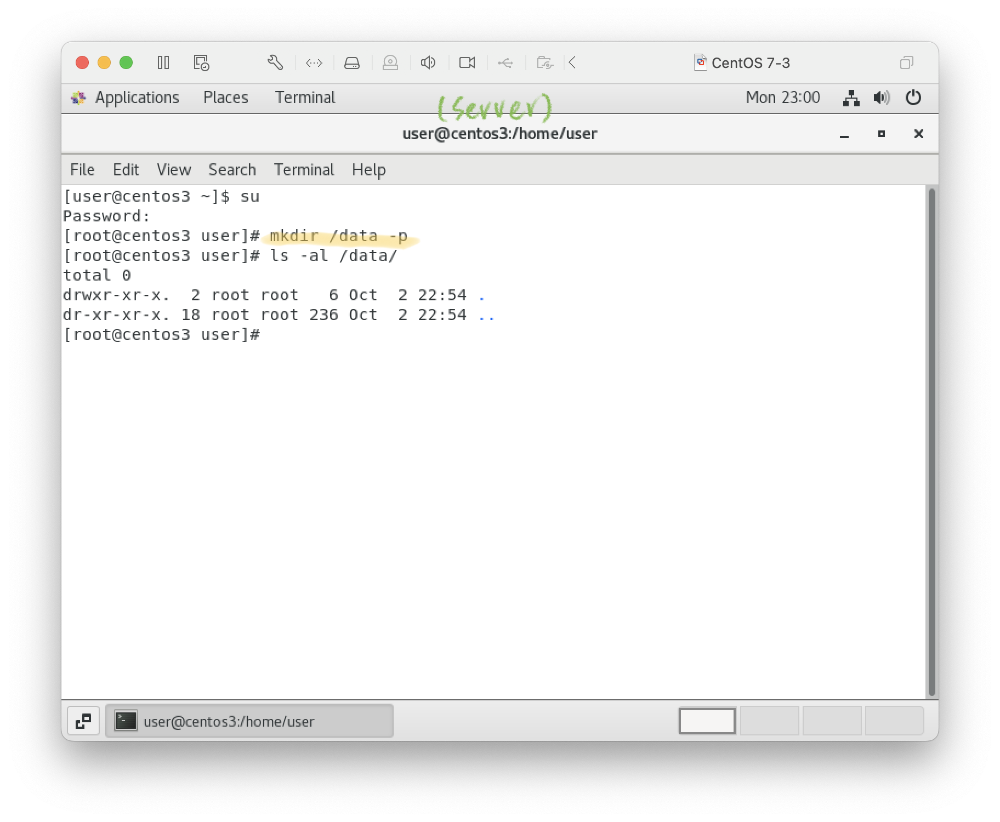
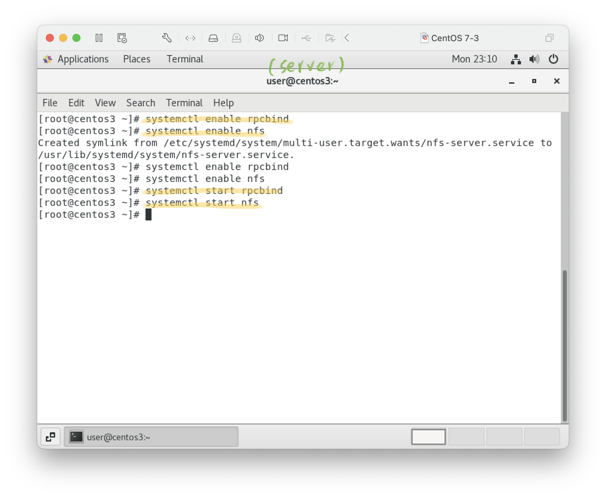
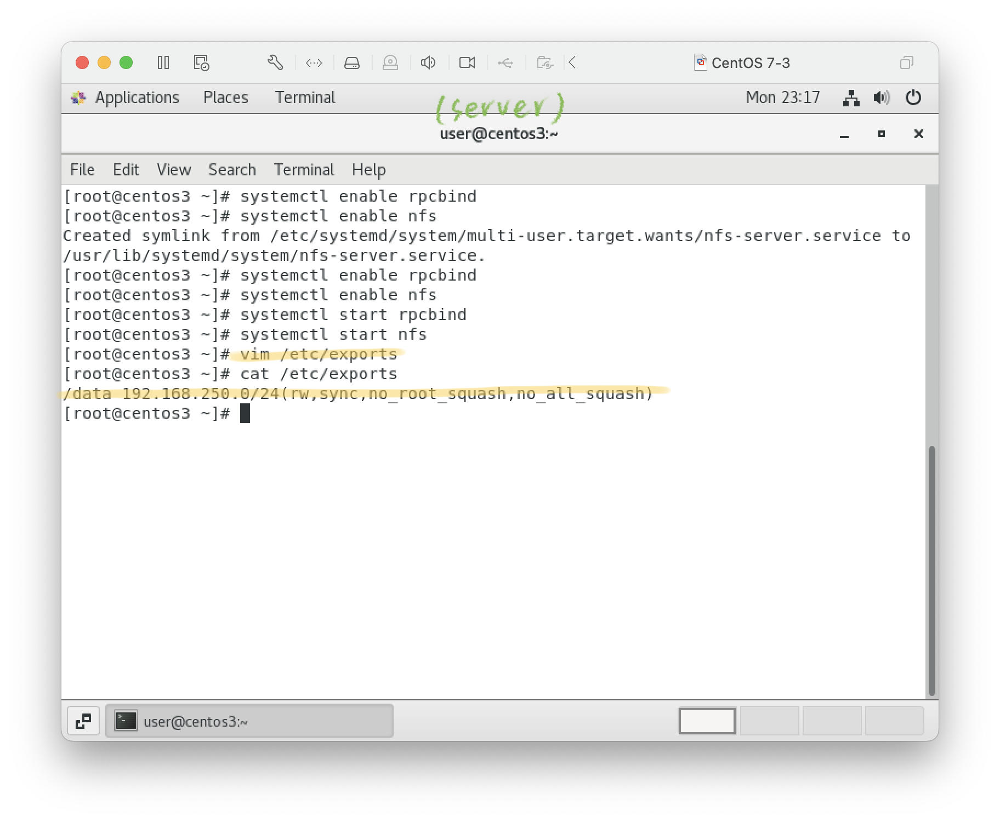

### 20231003
# [NFS : network file system](https://qizhanming.com/blog/2018/08/08/how-to-install-nfs-on-centos-7)

## 建議使用三台虛擬機進行課程
- vm1, vm2: nfs client  
- vm3: nfs server

## setup
1. mkdir  
    server(vm3): 
    ```
    mkdir /data -p
    ```
    
    client(vm1, vm2):
    ```
    mkdir /nfs-data -p
    ```
    
2. Install nfs
    ```
    yum install nfs-utils -y
    ```
    
3. Enable NFS service  
   Server:
    ```
    systemctl enable rpcbind
    systemctl enable nfs
    systemctl start rpcbind
    systemctl start nfs
    ```
    
    Client:
    ```
    systemctl enable rpcbind
    systemctl start rpcbind
    ```
    
4. Server: setup sharing dir
    ```
    vim /etc/exports
    ```
    ```
    /data 192.168.250.0/24(rw,sync,no_root_squash,no_all_squash)
    ```
    
    - /data: 共享目录位置。  
    - 192.168.0.0/24: 客户端 IP 范围
    - rw: 权限设置，可读可写。
    - sync: 同步共享目录。
    - no_root_squash: 可以使用 root 授权。
    - no_all_squash: 可以使用普通用户授权。
5. Server: restart & check
    ```
    systemctl restart nfs
    showmount -e localhost
    ```
    
6. Client: connect
    ```
    mount -t nfs 192.168.server.ip:/dir /map-loacl-dir
    ```
    
    - t: type

## Test
