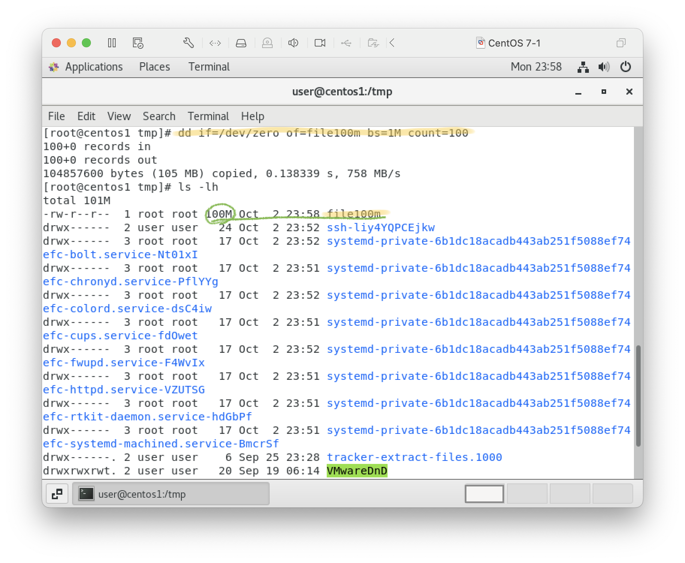

### 20231003
# CH 11
## 11-1 檔案工具
3. `dd`: 讀取檔案並輸出
    - 複製檔案，指令輸入來源與輸出對象
    - 產生特定大小的測試檔案
        ```
        dd if=/dev/zero of=file100m bs=1M count=100
        ```
        

4. `wc`: word count 統計檔案行數與字數
    ```
    wc (file)
    ```
    
    - l: lines
    - w: words
    - c: chararcters
5. [`tr`](https://wangchujiang.com/linux-command/c/tr.html): 取代或刪除
    
    - 常用集合：
        - [:alnum:] 所有大小寫字母與數字
        - [:alpha:] 所有大小寫字母
        - [:blank:] 空白
        - [:digit:] 所有數字
        - [:lower:] 所有小寫字母
        - [:upper:] 所有大寫字母
    - 常用參數：
        - '' 字符集
        - d: delete
        - c: use the complement of SET1
            
    - 加解密：
    ```
    cat (file) | tr '0-9' '9876543210' #加密
    cat (file) | tr '9876543210' '0-9' # 解密
    ```
    

## 11-3 其他工具
1. `seq`: 產生序列數字