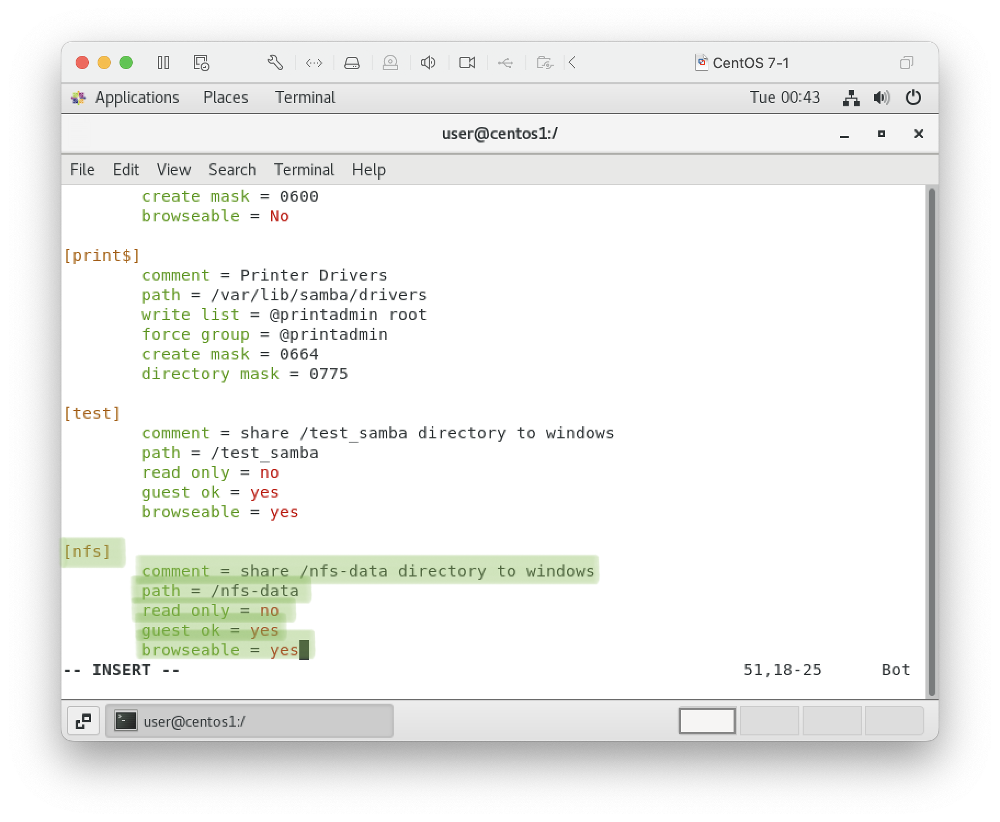
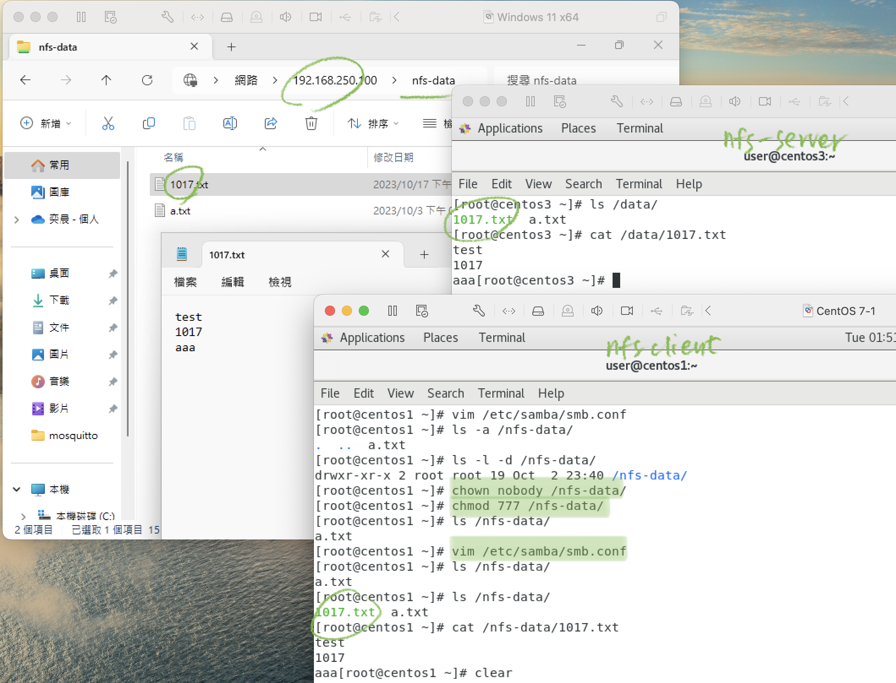

### 20231017
# [SAMBA: Windows與CentOS檔案共享](https://josephjsf2.github.io/linux/2019/11/01/share_centos_folder_with_windows.html)

    SMB(Server Message Block)：最初由IBM提出，經過微軟大幅改良，主要目的為允許電腦間可以透過LAN對遠端主機檔案或目錄進行讀寫。

    CIFS(Common Internet File System)：基於SMB而發展出來的協定，允許網路上的機器分享檔案目錄文件與印表機，同時支援授權認證，能讓Windows系統互相溝通。

    NFS(Network Fils System)：在Unix上互相分享檔案的系統稱為NFS，NFS僅允許Unix機器互相溝通。

    SAMBA：可以讓UNIX系統與Windows系統進行SMB/CIFS 檔案共享的自由軟體，後續版本中除了分享檔案目錄與印表機外，也可以整入Windows AD。

1.  selinux = disabled  
    firewalld = inactive
2. install 
    ```
    yum install samba samba-client samba-common -y
    ```
    
3. set dir mode
    ```
    chmod 777
    ```
    
    - char 1:   
        d: directory/ l: symbolic link/ -: regular file/ p: pipe  
    - char 2-4:  
        r: read/ w: write/ x: execute  
    - char 5-7:  
        user group's permissions
    - char 8-10:  
        other group's permissions 
        
4. 設定共享資料夾  
    ```
    vim /etc/samba/smb.conf
    ```
    
5. `testparm`: 測試SAMBA設置
    
6. 重啟、查看狀態
    ```
    systemctl restart smb
    systemctl status smb
    ```
    
    ```
    netstat -tunlp | grep smb 
    ```
    
    SAMBA預設埠號: 139, 445
7. 設定SAMBA使用者密碼
    ```
    smbpasswd -a (username)
    ```
    
8. Windows: 開啟共享資料夾
    1. 於檔案總管輸入linux ip
        
    2. 輸入使用者名稱及密碼
          
    - Complete
    
    
9. 新增使用者
    - Linux: 
    ```
    id (username) // check if user exist
    useradd (username) // add user
    passwd (username) // set user password(for linux system)
    smbpasswd -a (username) // set user password for SAMBA
    ```
    - Windows: 
    ```
    net use * /delet // 刪除暫存帳密
    ```
    
    - Complete
    

## HW: 整合samba與nfs資料夾
- 新增 /nfs-data 為SAMBA共享
    ```
    vim /etc/samba/amb.conf
    ```
    
- 修改資料讀寫權限
    ```
    chmod 777
    ```
- Complete
    
