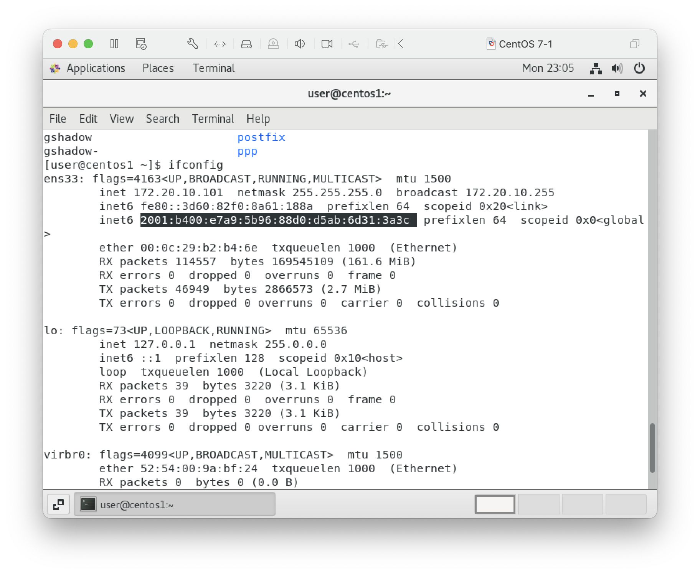
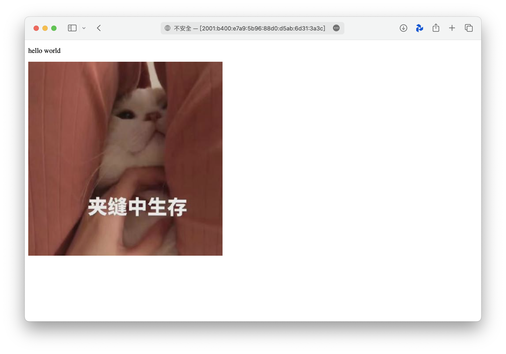
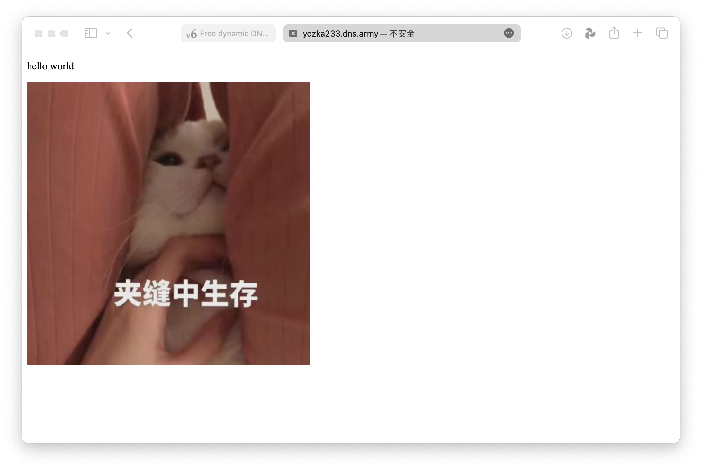

### 20231024

# ipv6 網頁伺服器
### 需使用手機熱點取得ipv6位置
1. 取得vm ipv6
    ```
    ifconfig
    ```
    
2. 於本機瀏覽器輸入: http://[(vm ipv6)]/(檔案名稱)  
    ex. http://[2001:b400:e7a9:5b96:88d0:d5ab:6d31:3a3c]/test/test.html
    
3. 使用 https://dynv6.com 取得dynamic DNS
4. 以DNS取代ipv6  
    ex. http://yczka233.dns.army/test/test.html
    